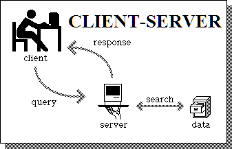
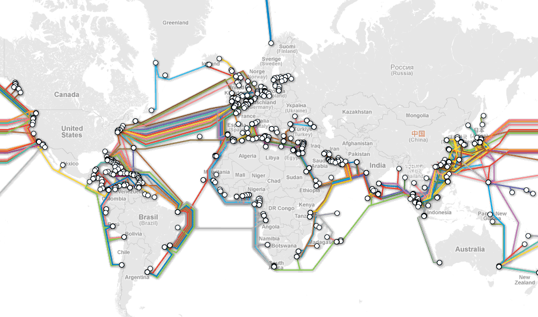
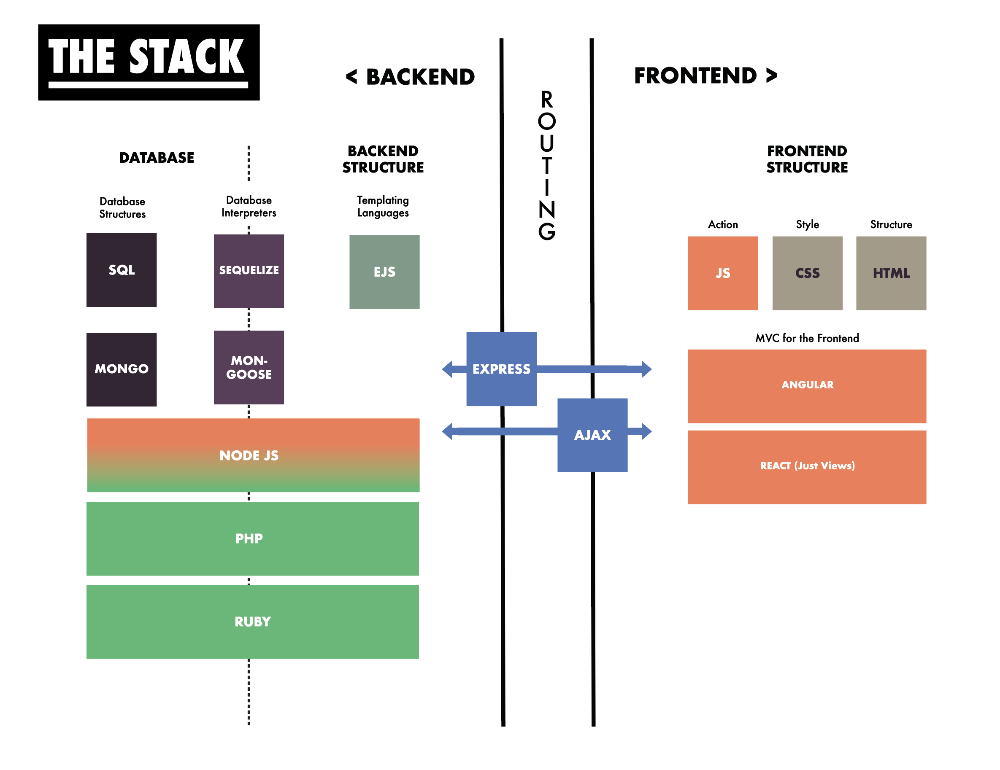
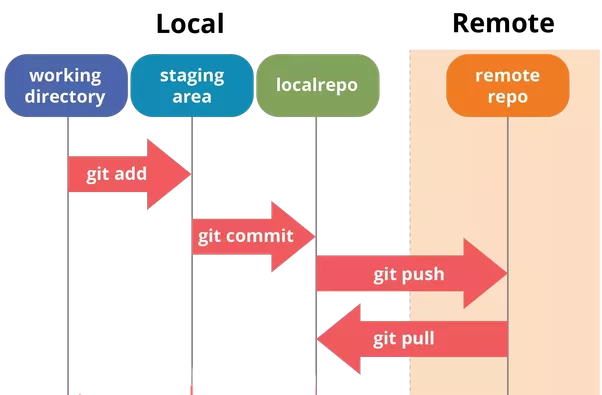

# Development Crash Course

## Why must I learn this, Nick?!
Could you acept a blueprint from an architect that didn't know the difference between particle board and solid oak wood? Then why should anyone trust you to design a UX plan for a technology you can't comprehend?

The tech industry is slowly waking up to this reality - and it's time to get in front of it!

## How much do I need to know???
The answer, of course, is as much as possible. Realistically, we're going to cover a few key points:

1. What the internet is, and how does it works
2. How modern websites operate
3. How developers do their work
4. The basics of Frontend Web Development

## The Internet
[How does the internet work?](https://youtu.be/iDbyYGrswtg)
Unforutnately, many people have a very vague grasp of how the internet actually works - including UX designers! Below is an extremely simplified version of how things actually work:

#### Client
This is you, at home on your computer. Your laptop is what's known as a **client**. 

#### Server
This is someone else's computer, running special software to allow it to be accessed by other **clients**. It could be a single machine or, more commonly, a large collection or 'farm' of servers. They tend to be extremely powerful. This is where websites are stored - when you push a site live, your code is saved to one of these servers. Usually, this space is rented monthly.

#### Request/Response Cycle
This is illustrated with the little arrows that say **query** and **response**. This is fairly simple - you ask the server for something, like a webpage, and it responds by giving it to you. You can also ask for things like files, music, a streaming TV show - anything you download or view on the internet is the result of you making a **request** and the server answering with a **response**.

#### Database
Databases hold large collections of information, which the server is able to search through and retrieve information from. The most popular form of a database is a SQL table, which resembles a giant spreadsheet. This is where most sites will store things like user information or lists of products for sale.

### Where is the internet?
A little bit of it is everywhere! 

Google has server compounds in Oregon, Georgia, Virginia, North Carolina, and South Carolina. Facebook has servers in North Carolina, Sweden, and Iowa. The Pirate Bay hosted it's servers inside of a Dutch Nuclear Fallout Shelter in the Netherlands called the [Cyberbunker](https://en.wikipedia.org/wiki/CyberBunker), though it has since moved to a new, undisclosed location. **As a result, the internet can not be "destroyed"**. You would have to destroy every individual server in every city in the world - if that were to happen, we probably wouldn't be around to use it anyway ¯\_(ツ)_/¯

#### However . . .
There's one piece of digital glue tying all these servers together: 

Beneath the ground and through the ocean, millions of cables connect our computers to servers using phone lines, coaxial cable, and fiber optic lines. These were built by ISPs, or Internet Service Providers, as a means of transfering data. Because there are so few ISPs (i.e., Comcast & CenturyLink), a coordinated effort to shut off those lines could take down the internet. This is what happened during the Arab Spring in Egypt in 2009. However, protesters were quick to begin setting up their own ISPs by hijacking the lines that were already installed. 

## How Modern Websites Work

GA's Web Development Immersive program trains what we call "full-stack" developers. What does that even mean?

In development, the **stack** refers to the layers of languages, frameworks, and protocols that are used to make a website. 

For example, the construction of a house general starts with a foundation of stone or concrete, followed by wood, bricks, or steel, and then finished with things like different types of paint or clay shingles. Every house has a foundation, a frame, an exterior, and a roof - but what materials those parts are comprized of vary greatly. Also, some builders or construction companies might choose to specialize in certain materials.

For web development, there's hundreds of different technologies you might choose to work with, but the basic parts remain the same:

1.) Database
2.) Backend Language(s)
3.) Routing
4.) Frontend

Below, you'll see an illustration of the tech stacks GA teaches:

This works a lot like a restaurant - just ask Nick!

## How Do Developers work with code?

While exact practices will vary from company to company, [Github](https://github.com/) is the most widely used tool for version control and team workflow. It consists of creating **repositories** where your projects can live.

**Git** a version control tool that works locally on your machine. It allows you to "save" various snapshots of your work, and move forwards and backwards through it. It also allows you to create different **branches** that act like alternate timelines. 

**GitHub** is an online service which hosts your git repositories for free. Not only is it great for saving remote backups, it also allows other developers to grab a copy of your code, and work along side you.

### Gitflow

#### Forking and Cloning

For most of your work, you'll be using repos that already exist, rather than creating them from scratch. For this, you'll be **forking** and **cloning**.

Take a look at the URL bar of this lesson - it should say `https://github.com/den-UXDI/DevelopmentCrashCourse`. Notice the `den-UXDI` part - that means that this repo is located in the `den-UXDI` organization. You have access to see it, but not make changes. 

Let's say you wanted to make a copy that you COULD edit. For that you'd want to **fork** it. When you fork a repo (there's button in the top right of the page to do so), you're making a personal copy of that repository. If I were to fork it, I would now find an exact copy of it at `https://github.com/nickandersonr/DevelopmentCrashCourse`.
Once you fork a repo, it stops recieving updates from whoever created it. Think of it like taking a 'fork in the road' - you're now going in a different direction than the origninal creator.

If you wanted to work on the code yourself, you'd then need to **clone** the repo. This means downloading all the code of the repo to your local machine. You would then be able to 'sync' your files between your local copy, and the remote copy that the rest of the world has access to.

#### Committing and Pushing

Now that you've got a local and remote copy, you'll need to move code between those two places:

To make this simpler, I suggest using a tool like [Github's App](https://desktop.github.com/). It's a much more visual way of tracking your changes.

